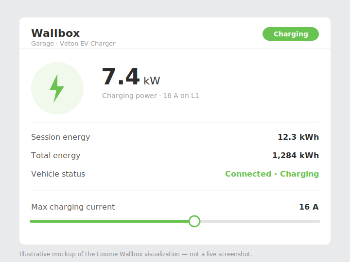

# Veton EV Charger — Loxone integration

A ready-to-import **Loxone Config** project that integrates a **Veton EV charger**
(Phoenix Contact **CHARX** controller) into Loxone over **Modbus/TCP**, surfaced
through Loxone's native **Wallbox** block.

This is the Loxone counterpart of the [Home Assistant integration](https://github.com/Veton-ev/HA-Veton).

## Screenshot

> Illustrative mockup of the Wallbox visualization. A real screenshot from the
> Loxone app/Config is welcome — drop a PNG into `docs/images/` and update this.

## What's included

- **`Veton.Loxone`** — a Loxone Config project (Config 16.x) containing:
  - a **Modbus server + device** preconfigured with the CHARX register map,
  - the charger's metering + status mapped to inputs (energy, power, per-phase
    voltage & current, vehicle status, error code, release mode, SOC),
  - write outputs for **charging release**, **max charging current**, and **locking**,
  - a **Wallbox** function block and a visualization page.

## Requirements

- **Loxone Miniserver** (Gen 1 or Gen 2) with **Loxone Config 16.0** or newer.
- A **Veton / CHARX** charger reachable on the LAN with **Modbus/TCP enabled** (port `502`).

## Install

1. Open `Veton.Loxone` in Loxone Config (or copy the **Veton** Modbus device +
   Wallbox page into your existing project).
2. Select the **Veton** Modbus server and set its **Address** to your charger's
   IP (port `502`). *The project ships with this field blank on purpose.*
3. The register addresses target **connector 1** (`1xxx`). For another connector,
   offset by `connector × 1000` (connector 2 → `23xx`, etc.).
4. Save to the Miniserver.

## Register map (CHARX)

| Function | Register | Operation |
|---|---|---|
| Counter active energy | X250 | read |
| Active power | X244 | read (5 s) |
| Voltage L1 / L2 / L3 | X232 / X234 / X236 | read |
| Current L1 / L2 / L3 | X238 / X240 / X242 | read |
| Vehicle status | X299 | read |
| Charging release mode | X120 | read |
| SOC | X264 | read |
| Error code | X293 | read |
| Max charging rate (A) | X301 | **write** |
| Charging release | X300 | **write** |
| Locking | X303 | write |

> Connector offset = `connector × 1000`, so connector 1 → registers `1xxx`.

## Multiple charging points

This project covers **one charging point** (connector 1, the `Veton - Charger 1`
Modbus device). For a controller with several charging points, **duplicate** the
Modbus device + its Wallbox block per point and shift every register address by
`connector × 1000`:

| Charging point | Register base | e.g. max current |
|---|---|---|
| 1 | `1xxx` | `1301` |
| 2 | `2xxx` | `2301` |
| 3 | `3xxx` | `3301` |

## Notes

- Ships with the Modbus server **IP blank** and the document **APPKEY cleared** —
  set your own on import.
- Can also be submitted to the official **Loxone Library** (a curated process
  done from within Loxone Config / Loxone's portal).

## License

[MIT](LICENSE) — free to use and modify.
