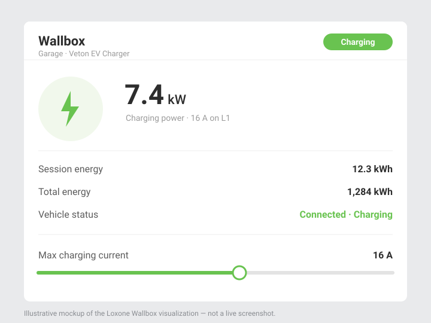

# Veton EV Charger — Loxone integration

A ready-to-import **Loxone Config** project that integrates a **Veton EV charger**
(Phoenix Contact **CHARX** controller) into Loxone over **Modbus/TCP**, surfaced
through Loxone's native **Wallbox** block.

This is the Loxone counterpart of the [Home Assistant integration](https://github.com/Veton-ev/HA-Veton).

What changed recently — and what to re-check if you already deployed an earlier copy of
this project — is in the [changelog](CHANGELOG.md).

## Screenshot



> Illustrative mockup of the Wallbox visualization. A real screenshot from the
> Loxone app/Config is welcome — drop a PNG into `docs/images/` and update this.

## What's included

- **`Veton.Loxone`** — a Loxone Config project (Config 16.x) containing:
  - a **Modbus server + device** preconfigured with the CHARX register map,
  - the charger's metering + status mapped to inputs (energy, power, per-phase
    voltage & current, vehicle status, error code, release mode, SOC, last RFID
    card → the Wallbox block's **Uid** input),
  - write outputs for **max charging current** (X301) and the **CHARX safety
    watchdog** (X306 fallback current + X307 timer),
  - a **Wallbox** function block and a visualization page.
- **`Veton-2CP.Loxone`** — the same project for a **two-charging-point** cabinet:
  one Modbus device carrying both points (CP1 on `1xxx`, CP2 on `2xxx`), with the
  Wallbox block, formulas and visualization mirrored per point.
- **`MB_Veton.xml`** — a **Modbus device template** (the format the Loxone
  Library expects). Importing it adds the CHARX register map (13 sensors +
  3 actuators) to a Modbus device in one step, without the rest of the
  project. Targets **charging point 1** (`1xxx`). Three of the inputs need a
  manual validity-range fix after import — see
  [After importing the template](#after-importing-the-template-required).
- **`MB_Veton_CP2.xml`** — the same template for **charging point 2** (`2xxx`),
  to add alongside the first one on a two-point cabinet.

## Requirements

- **Loxone Miniserver Gen 2** with **Loxone Config 16.0.6.10** or newer (the
  templates declare `minVersion="16000610"`). Both projects are saved as Gen 2
  (`Miniserver="2"`) and have only been tried there — Gen 1 is untested, not known
  to be unsupported.
- A **Veton / CHARX** charger reachable on the LAN with **Modbus/TCP enabled** (port `502`).
- For Loxone to **control** the charging current (not just read the charger), the
  charger must be in **external-control mode** — see
  [Who controls the current](#who-controls-the-current-internal-load-management-vs-loxone).
  As shipped, a Veton charger's own load management owns `X301` and overwrites
  every value Loxone writes within seconds; reading works regardless.

## Install

1. Open `Veton.Loxone` in Loxone Config (or copy the **Veton** Modbus device +
   Wallbox page into your existing project).
2. Select the **Veton** Modbus server and set its **Address** to your charger's
   IP (port `502`). *The project ships with this field blank on purpose.*
3. The register addresses target **connector 1** (`1xxx`). For another connector,
   offset by `connector × 1000` (connector 2 → `2xxx`: `2120`, `2232`, `2244`,
   `2250`, `2301` …).
4. Save to the Miniserver.
5. Have the charger put in **external-control mode** (next section) — otherwise
   the Wallbox block's setpoint and pause never take effect.
6. In the Loxone app **select a charging mode** for the Wallbox, and in Loxone
   Config set the block's ***Mode after unplugging vehicle*** parameter to a
   charging mode (e.g. *Max. charging power*) rather than *Off* — otherwise the
   block asks for 0 kW and the car is paused until someone picks a mode. The
   project ships with no mode selected and that parameter at its default.
   Note the block's `allow` input is shipped **inverted and unwired**
   (unconnected = charging allowed); wiring a "1 = allowed" signal to it
   without removing the inversion pauses the car.

## Who controls the current: internal load management vs Loxone

A CHARX has its **own load management** built in, and a Veton charger ships with
it **active**: the charging points belong to a CHARX load circuit and the
internal manager rewrites the `X301` setpoint of every point on each cycle. In
that state everything this project **reads** works — power, energy, voltages,
currents, vehicle status (`Vc`/`Cac`), error code — but every `X301` **write**,
the pause included, is overwritten within seconds. It looks as if the Wallbox
block "does nothing".

| Charger state | Loxone reads | Loxone `X301` writes |
|---|---|---|
| Internal load management active (as shipped) | work | **overwritten within seconds** |
| External-control mode | work | **take effect** |

For Loxone to control current, the charger has to be put in **external-control
mode**: the charging points are detached from the CHARX load circuit so that
nothing on the charger writes `X301` any more. On a Veton-managed charger this
is done **by Veton** — through the Veton app or backend — not from Loxone; ask
for it when you commission the installation.

Two consequences of that mode:

- **The watchdog is the only protection left.** Once nothing on the charger
  owns `X301`, a Miniserver that dies mid-session would leave the last setpoint
  in place forever. That is why the project ships the **X306/X307 watchdog**
  (below) and why it must stay in.
- **One energy manager per charger.** Do not run another manager — Veton's
  solar/smart charging modes, a second EMS, a Home Assistant automation — on
  the same charger at the same time as Loxone. Two writers fight over `X301`,
  and the usual result is a car that ends up **paused** because the loser wrote
  0 or 6 A last.

## Register map (CHARX)

| Function | Register | Operation |
|---|---|---|
| Counter active energy | X250 | read |
| Active power | X244 | read (5 s) |
| Voltage L1 / L2 / L3 | X232 / X234 / X236 | read |
| Current L1 / L2 / L3 | X238 / X240 / X242 | read |
| Vehicle status | X299 | read |
| Last RFID card | X275 | read (5 s), text |
| Charging release mode | X120 | read |
| SOC | X264 | read |
| Error code | X293 | read |
| Max charging rate (A) | X301 | **write** (FC06, re-sent every 60 s) |
| Watchdog fallback current (A) | X306 | **write** (FC06, re-sent hourly) |
| Watchdog timer (s) | X307 | **write** (FC06, re-sent every 60 s) |
| Charging release | X300 | *not written* — see below |
| Locking | X303 | *not written* — see below |

> Connector offset = `connector × 1000`, so connector 1 → registers `1xxx`.

All values are FC03 holding-register reads / FC06 holding-register writes — the
CHARX has **no coils**. Voltages, currents and power arrive in **milli-units**;
the inputs carry a two-point correction that scales them:

| Input | Wire | Displayed as | Correction |
|---|---|---|---|
| Active power (X244) | mW | **kW** | `SourceValHigh="1000000" DestValHigh="1"` (×1e-6) |
| Voltage / current | mV / mA | V / A | `1 → 0.001`, `100 → 0.1` (×1e-3) |
| Counter active energy (X250) | Wh | kWh | `1 → 0.001`, `100 → 0.1` (×1e-3) |

Active power feeds the Wallbox block's power input, which is **kilowatts** — an
earlier mW→W correction there made the block read 1000× high.

### Why X300 / X303 are not written

Earlier versions of this project and of the templates wrote **X300 (charging
release)** and **X303 (locking)**. Both writes are gone as of 2026-09-03, for
two independent reasons:

1. **Policy.** Veton chargers ship with **release mode = OCPP**. The OCPP
   backend decides *whether* a car may charge (authorization, start/stop,
   billing, app visibility); an EMS only decides *how fast*, via `X301` — which
   works in every release mode. Driving `X300` means taking release away from
   OCPP, which breaks authorization, session/transaction records and
   app/backend visibility. See
   [`Veton-EMS-Integration/docs/modbus.md`](https://github.com/Veton-ev/Veton-EMS-Integration/blob/main/docs/modbus.md).
2. **They never worked anyway.** Both were issued as `ModbusCmd="5"` —
   *FC05 Write Single Coil*. A CHARX exposes **holding registers only**
   (FC03 read / FC06 write, FC16 for multi-register writes); it has no coils, so
   every one of those writes was rejected.

A **standalone, non-OCPP** deployment (no backend, release mode = `Modbus`) may
legitimately need them. Add them by hand, as **FC06 Write Single Register
(`ModbusCmd="6"`), never FC05 Write Single Coil**:

| Function | Register | Values | Requires |
|---|---|---|---|
| Charging release | X300 | 0 = off, 1 = allow | release mode = `Modbus` (X120 = 5) |
| Locking | X303 | 0 / 1 | locking mode = external |

Do not do this on a Veton charger that talks to the Veton backend.

Note that **pausing a car via `X301 = 0`** (see
[Pause semantics](#pause-semantics-what-a-0-kw-request-does)) does **not** take
release away from OCPP either: OCPP still authorises the session and keeps
recording it; the pause is simply a current cap of zero. The session stays open
and resumes as soon as the cap goes back to 6 A or above.

### Watchdog (X306 / X307)

The CHARX has a **safety watchdog** on the current setpoint: if nothing writes
**X307** for the number of seconds it holds, the charger falls back to the
current in **X306**. It protects against a Miniserver that dies mid-session
while `X301` is sitting at a high value.

| Register | Ships as | Meaning |
|---|---|---|
| X306 | **6 A** | fallback current when the timer expires (valid range 6–80 A; a value outside it withdraws the charging release) |
| X307 | **300 s** | the deadline; `65535` disables the watchdog |

6 A is the IEC 61851 minimum, so a dead Miniserver **slows the car down rather
than cutting it off**.

Loxone has no "keep-alive" primitive — what feeds the watchdog is the Modbus
actuator's **`RepeatRate`**, which Loxone Config 17's help text for the Modbus
output repeat property describes as the *"interval in seconds, at which the
output value is sent again"*. Whether a value of **0** is also re-sent has not
been confirmed on a Miniserver. Either way the pause is written once, on
change, and that write is what pauses the car; the 60 s re-send matters for the
non-zero setpoints. X307 therefore ships with `RepeatRate="60"` — five re-sends of margin inside the
300 s window — and X306, which only needs to be present, with `RepeatRate="3600"`.
In the projects both registers are driven by a constant **Formula** block feeding
an output ref; in the templates they are plain actuators you feed with a constant
(`6` and `300`).

| Actuator | `RepeatRate` | Why |
|---|---|---|
| X301 max current | **60 s** | re-asserts the setpoint every minute (see below; the pause itself is written on change) |
| X306 fallback current | 3600 s | only needs to be present |
| X307 watchdog timer | **60 s** | feeds the watchdog; five re-sends inside the 300 s window |

**`RepeatRate` must stay well below the X307 value — keep at least a 2× margin.**
If you raise it above the timer (or lengthen the timer's re-send interval), the
watchdog fires during normal operation and pegs the charger at the 6 A fallback.

`X301` is re-sent every **60 s** as well (it used to be hourly). Some CHARX
firmware has been seen to drop an externally written `X301` back to 0 after a
controller-side restart or a stray write; a client that re-sends its setpoint
restores it within one `RepeatRate` interval, one that writes once an hour
leaves the car at 0 for up to an hour.

### Vehicle status (X299) → Wallbox **Vc** / **Cac**

`X299` is **one register holding two ASCII characters** (IEC 61851 state), so it
arrives in Loxone as a plain number:

| State | Meaning | Register value |
|---|---|---|
| `A1` / `A2` | no vehicle connected | 16689 / 16690 |
| `B1` / `B2` | vehicle connected, not charging | 16945 / 16946 |
| `C1` / `C2` | charging (no ventilation) | 17201 / 17202 |
| `D1` / `D2` \* | charging (ventilation required) | 17457 / 17458 |
| `E0` | CP short circuit / PE lost | 17712 |
| `F0` | EVSE fault / unavailable | 17968 |
| `IN` | invalid state | 18766 |

\* `D1` / `D2` are defined by IEC 61851 (charging with ventilation required,
CP at 3 V) but are **not among the states CHARX actually emits on X299** — its
register map lists only `A1, A2, B1, B2, C1, C2, E0, F0, IN`. The rows are kept
because the formulas below bound their range harmlessly; do not expect to see
them on a Veton charger.

The Wallbox block's **Vc (Vehicle connected)** and **Cac (Charging active)**
inputs therefore need digital signals, not the raw register. The project derives
both with **Formula** blocks fed from the *Vehicle status* input:

| Block | Formula | On for |
|---|---|---|
| `Vehicle connected` → **Vc** | `IF(I1>16944;IF(I1<17459;1;0);0)` | B/C/D — a car is plugged in |
| `Charging active` → **Cac** | `IF(I1>17200;IF(I1<17459;1;0);0)` | C/D — the car is drawing |

Both are **0 for A (no vehicle) and for the fault states E0/F0/IN**. Wire the
same two formulas if you build the project yourself from `MB_Veton.xml`.

### RFID card → Wallbox **Uid** (user attribution)

The *Last RFID card* input reads `X275`, where the CHARX keeps the UID of the
card **last presented** as ASCII text: 10 holding registers, big-endian,
NUL-padded — 14 hex characters for a 7-byte card (`04A1B2C3D4E5F6`), 8 for a
4-byte card. It is read every 5 s as a Loxone **String** input
(`ModbusDataType="101"`, plain FC03, nothing is written) and wired straight
to the Wallbox block's **Uid (User ID)** input in both projects. That is what
attributes a session to a person: the block's charge log records the Uid,
its own `Uid` output echoes it, and the app's history shows who charged.

To make it match, give each Loxone user a **User ID** equal to that person's
card UID exactly as the *Last RFID card* input shows it (the *User ID* property
of the user in Loxone Config). Per Loxone's documentation a session is reassigned
to a driver who taps while the car is already plugged in **only if that user
has a valid User ID set**; drivers without one are logged as whoever the
block already held.

What is measured and what is not:

- The register contents were verified on production chargers (firmware
  1.7.3, release mode OCPP) against the charger's own RFID event stream, and
  X275 is populated in every release mode.
- `X275` is **sticky**: it keeps the previous card until the next tap. So at
  plug-in the block first sees the *previous* driver; once the new driver
  taps, the Uid changes and Loxone reassigns the session (User ID permitting).
  A session started **without a tap** — from the Veton app or remotely —
  inherits the previous card and is attributed to that person.
- The CHARX has a "reset last RFID" register (`X308`, write > 0). On the
  current firmware it was **measured inert** (write acknowledged, `X275`
  unchanged), so this project deliberately does not write it; the sticky
  behaviour above is what you get.
- **Confirm the register count in Loxone Config.** Loxone has no attribute
  for the length of a String input, so how many registers it reads is not
  documented. Open the project against a charger and look at the *Last RFID
  card* value: the full 14 characters of a 7-byte card means it reads enough;
  fewer characters means Loxone reads fewer registers — the leading
  characters are still card-specific and usable as a User ID, but set the
  users' IDs to what the input actually shows.

## Setpoint: three-phase (default) vs single-phase (`mono`)

The Wallbox block asks for **power (kW)**; `X301` wants **current (A)**. A
**Formula** block converts, and the project ships **two** of them on the Program
page:

| Block | Formula | Inputs | For |
|---|---|---|---|
| `3 fase` | `IF(I1>0;MIN(MAX(INT((I1*1000)/(400*1,732));6);80);0)` | I1 = Wallbox `outLimit` [kW] | three-phase 400 V — **wired by default** |
| `mono` | `IF(I1>0;IF(I2>100;MIN(MAX(INT((I1*1000)/MAX(I2;100));6);80);6);0)` | I1 = Wallbox `outLimit` [kW], I2 = *Voltage of phase L1* [V] | single-phase — **shipped on the page, deliberately not wired** |

**Only one of the two may be connected to `Max Charging Rate I`.** Both were
connected in earlier versions, so two blocks wrote conflicting values into the
same register, last-writer-wins. `mono` was disconnected on 2026-09-03 and
`3 fase` kept.

Both formulas are **pause-aware**: the outer `IF(I1>0;…;0)` passes a 0 kW
request through as **0 A**, and any request above 0 kW is converted, truncated
and clamped to `X301`'s valid **6–80 A** range. What that 0 does is the next
section.

### Pause semantics: what a 0 kW request does

The Wallbox block puts its target power (`outLimit`, "Tp") to **0** when the
session is paused, when load shedding leaves nothing for the car, when the block
is *Off*, or when no mode allowing charging is active. On a CHARX, **writing
`X301 = 0` withdraws the charging release** (documented in
`Veton-EMS-Integration/docs/modbus.md`) — the charger tells the car to stop
drawing. The project uses exactly that as the pause:

| Wallbox target power | `X301` written | Charger | Car |
|---|---|---|---|
| **0 kW** | **0 A** | withdraws the charging release | **pauses** |
| > 0 kW | 6 … 80 A | keeps / restores the release, caps the current | charges, resumes after a pause |

Earlier versions clamped every request to a 6 A floor, so "pause" from the
Wallbox block meant "charge at 6 A". Now a pause is a pause. Things to know
before relying on it:

- **No charging mode selected, or *Mode after unplugging vehicle* = Off, is
  the #1 reason a car will not charge.** The block outputs a target power of 0
  whenever no charging mode is active, and the project ships with no mode
  selected and that parameter at its default. So a fresh import in
  external-control mode writes `X301 = 0` and re-sends it every 60 s: the car
  never starts. The same happens after anything the block treats as an unplug
  — including the charger being unreachable for a while: the *Vehicle status*
  input reads 0, `Vc` drops, the session ends and the block falls to its
  mode-after-unplug. Select a mode in the app and set *Mode after unplugging
  vehicle* to a charging mode (e.g. *Max. charging power*), see Install step 6.
  Also: the block's `allow` input ships **inverted and unwired** (unconnected =
  charging allowed) — wiring a "1 = allowed" signal there without removing the
  inversion pauses the car.
- **Some EVs go to sleep during a long pause** and do not resume when current
  is offered again; they need an unplug/replug. Loxone has no way to send a wake
  pulse to the car, so if a car on your site behaves like that, avoid long
  pauses for it (raise the block's *Min. charging power* parameter, default
  4.16 kW, instead of pausing).
- **If the Miniserver dies during a pause**, the watchdog fallback (X306 =
  **6 A**) resumes the car at 6 A after 300 s. That is fail-safe toward *slow
  charging*, by design — a dead Miniserver never leaves a car stranded, but it
  also does not keep it paused.
- **Firmware 1.9.1 and ISO 15118.** The Phoenix Contact CHARX 1.9.1 release
  notes list a known issue: during an ISO 15118 session (plug-and-charge /
  high-level communication), a load-management setpoint **below 6 A opens the
  contactor under load** — and the 0 A pause is such a setpoint. On 1.9.1 with
  15118-capable cars, either disable 15118 on the charging point or go back to
  a never-pausing setpoint: remove the outer `IF(I1>0;…;0)` from both formulas,
  i.e. use `MIN(MAX(INT((I1*1000)/(400*1,732));6);80)` for `3 fase` and
  `IF(I2>100;MIN(MAX(INT((I1*1000)/MAX(I2;100));6);80);6)` for `mono` (the
  2026-09-03 forms, which floor a 0 kW request at 6 A). The fix script's
  `--check` will then report the formulas as not pause-aware — expected on
  such a site.
- **`X301 = 0` is the only zero this project ever writes**, and only while the
  Wallbox block asks for 0. Every other path — a voltage reading that is
  missing, a request too small to convert, the watchdog fallback — stays at
  **6 A or above**. If you edit the formulas, keep it that way.

### The setpoint truncates, it never rounds up

`X301` is a whole-ampere register, so the value Loxone computes has to become an
integer somewhere. Left to the register write it would **round**, and rounding
up asks the charger for more than the Wallbox block budgeted: 7.4 kW works out
to 10.68 A, which rounds to **11 A ≈ 7.62 kW** — about 0.22 kW over budget, and
up to ~0.5 A in the worst case. On a site whose load management handed out
exactly 7.4 kW, that overshoot is real current on a real fuse.

Both formulas therefore wrap the division in **`INT()`** (Loxone's documented
"integer function (removes decimals)"), so the setpoint **truncates**: 7.4 kW →
10 A, 11 kW → 15 A, 22 kW → 31 A. Loxone never asks the charger for more power
than the Wallbox block asked for. The one deliberate exception is the bottom of
the range: a request **above 0 kW but below 6 A** still lands on the 6 A floor,
because the CHARX accepts nothing between 0 and 6 A — 6 A is the IEC 61851
minimum. A request of exactly **0 kW** is not floored: it becomes the 0 A
pause described above.

### Single-phase (`mono`)

On a **single-phase supply**, swap the two blocks in Loxone Config: disconnect
`3 fase` from `Max Charging Rate I`, then connect `mono`'s output to it instead.
`mono` already ships with the pause, the clamp, the truncation **and** a
divide-by-zero guard:

```
IF(I1>0;IF(I2>100;MIN(MAX(INT((I1*1000)/MAX(I2;100));6);80);6);0)
```

`I2` is the **measured** *Voltage of phase L1* input, not a nominal 230 V — and
a measured input reads **0** whenever the charger is unreachable, the poll has
not landed yet, or the contactor is open. Dividing by that would yield 0 A, and
0 is precisely the value that withdraws the charging release — an *accidental*
pause. The inner `IF` guard means *"only compute a setpoint when we have a
plausible mains reading"*: **100 V** is below every real single-phase supply
(230 V nominal, 207–253 V at ±10 %) and above every partial or absent reading,
so anything at or under it falls back to the 6 A minimum instead of dividing
(the divisor is floored at 100 as well, in case Loxone evaluates both branches).
The outer `IF(I1>0;…;0)` is the deliberate pause, same as in `3 fase`.

If you would rather not depend on a live reading at all, use the nominal voltage
and drop the guard with it: `IF(I1>0;MIN(MAX(INT((I1*1000)/230);6);80);0)`,
leaving I2 unconnected.

> Loxone formulas use a **comma** as the decimal separator (`1,732`) and a
> **semicolon** as the argument separator.

## Multiple charging points

`Veton.Loxone` covers **one charging point** (connector 1). For a two-point
cabinet there is a ready-made variant: **`Veton-2CP.Loxone`**.

Register addresses are `connector × 1000 + register`:

| Charging point | Register base | e.g. max current |
|---|---|---|
| 1 | `1xxx` | `1301` |
| 2 | `2xxx` | `2301` |
| 3 | `3xxx` | `3301` |

### `Veton-2CP.Loxone` (two charging points)

One CHARX controller is a **single Modbus TCP endpoint**, so both charging
points live in **one** Modbus device (`Veton - Charger`) — CP1 on `1xxx`, CP2 on
`2xxx` — rather than two devices sharing an address. Everything downstream is
mirrored per point:

| Per charging point | CP1 | CP2 |
|---|---|---|
| Modbus sensors / actuators | 13 + 3 @ `1xxx` | 13 + 3 @ `2xxx` |
| Wallbox block | `Wallbox CP1` | `Wallbox CP2` |
| Vc / Cac formulas | `CP1 Vehicle connected` / `CP1 Charging active` | `CP2 …` |
| Error status block | `CP1 Error` | `CP2 Error` |
| Vehicle-status tracker | `CP1 Vehicle status` | `CP2 Vehicle status` |

Set the Modbus server **Address** once — both points share it.

For the charger I/O alone, `MB_Veton.xml` covers connector 1 and
**`MB_Veton_CP2.xml`** covers connector 2. For a third point and beyond, copy
either template and add `1000` to every `ModbusAddress`.

## Modbus device template (`MB_Veton.xml`)

For just the charger I/O (no full project), use the Modbus device template:

1. In Loxone Config, select the **Modbus Extension** (or Modbus TCP) in the
   periphery tree → ribbon **Device templates → Import template** → pick
   `MB_Veton.xml`. *(Or drop it straight into Loxone Config's template folder —
   `C:\ProgramData\Loxone\Loxone Config <ver>\Templates\Comm\` on Config 17,
   `…\LoxoneConfig <ver>\ENG\Comm\` on older builds. The filename **must** keep
   the `MB_` prefix.)*
2. Add the device, set the charger's **IP** (port `502`), then wire the inputs/
   outputs to a Wallbox block. The template's *Last RFID card* input (X275,
   String, 5 s) goes to the block's **Uid** input — see
   [RFID card → Wallbox Uid](#rfid-card--wallbox-uid-user-attribution); it
   needs no range fix.

The template targets **charging point 1** (registers `1xxx`); for more points,
offset every address by `connector × 1000` (see above).

This is also the file to submit to the official **[Loxone Library](https://library.loxone.com/)**
(curated by Loxone).

### After importing the template (required)

A Loxone Modbus **device template** has no way to express an input's validity
range — `MinVal`/`MaxVal` are not template attributes (Loxone's own shipped
templates use none). Three inputs therefore need their range widened **by hand**,
once, in Loxone Config after the device is added. The full `.Loxone` projects
already ship with all three applied; only template users have to do this.

| Input | Set | Why |
|---|---|---|
| **Counter Active Energy** (X250) | Maximum value `10000` → **`100000000`** | It is a **lifetime** kWh counter. A charger past 10 000 kWh exceeds the default ceiling and the input stops reporting — the charger on the bench already reads 12 182 kWh, so the old ceiling is already exceeded. |
| **Vehicle status** (X299) | Minimum **`0`**, Maximum **`65535`** | The value is two ASCII characters packed into one 16-bit register, i.e. ≈ 16 000–19 000 (`A1` = 16689 … `IN` = 18766) — out of range under the default limits, so `Vc`/`Cac` never go true. |
| **Error Code** (X293) | Minimum **`0`**, Maximum **`4294967295`** | X293/X294 is a **32-bit error bitfield**, not a fault number: bit *N* has the mask `2**(N-1)`. So bit 14 alone is already 8192, bit 15 is 16384 — past the stock ±10000 ceiling — and a bit 22 fault is **2 097 152**, 200× over it. Under the default limits the input silently stops showing real faults: every fault from bit 15 up is out of range, so the fault display reads clean while the charger is in error. |

In Loxone Config: select the input in the periphery tree → **Properties** →
*Minimum value* / *Maximum value*. Redo this after re-importing the template.

## Notes

- Ships with the Modbus server **IP blank** and the document **APPKEY cleared** —
  set your own on import.
- **The charger must be in external-control mode** before any `X301` write
  (setpoint or pause) sticks; as shipped, the CHARX internal load management
  overwrites it within seconds. Reads work either way. See
  [Who controls the current](#who-controls-the-current-internal-load-management-vs-loxone).
- **Nothing here writes charging release.** The projects and templates only write
  `X301` (current cap) and `X306`/`X307` (watchdog); release stays with OCPP.
  See [Why X300 / X303 are not written](#why-x300--x303-are-not-written).
- **A 0 kW request from the Wallbox block pauses the car** (`X301 = 0`); any
  request above 0 kW resumes it at 6–80 A. `X301 = 0` is the only zero this
  project writes. See
  [Pause semantics](#pause-semantics-what-a-0-kw-request-does) for the caveats
  (sleeping EVs, the watchdog resuming at 6 A, firmware 1.9.1 with ISO 15118).
- **No charging mode selected, or *Mode after unplugging vehicle* = Off, is
  the #1 reason a car will not charge**: the block then asks for 0 kW and the
  car is paused until someone picks a mode. Select a mode in the app and set
  that parameter to a charging mode (Install step 6).
- `X301` is **re-sent every 60 s**, so a setpoint that the charger drops is
  re-asserted within a minute (whether a 0 is re-sent too is unconfirmed; the
  pause is written on change either way).
- Template users: do the three manual range fixes above, otherwise the energy
  counter, the vehicle-status derived `Vc`/`Cac` signals and the error-code
  display will not work.
- The `X301` setpoint **truncates** rather than rounds, so Loxone never asks the
  charger for more power than the Wallbox block budgeted. See
  [The setpoint truncates, it never rounds up](#the-setpoint-truncates-it-never-rounds-up).

## License

[MIT](LICENSE) — free to use and modify.
